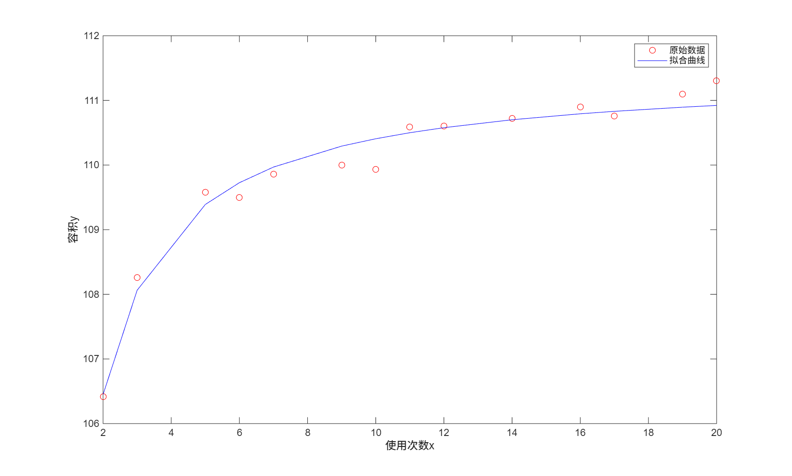

# 6

## 2

炼钢厂出钢时所用的盛钢水的钢包，在使用过程中由于钢液及炉渣对包衬耐火材料的侵蚀，使其容积不断增大。经试验，钢包的容积与相应的使用次数的数据列表如下：

|使用次数$x$|容积$y$|使用次数$x$|容积$y$|
|---|---|---|---|
|2|106.42|11|110.59|
|3|108.26|12|110.60|
|5|109.58|14|110.72|
|6|109.50|16|110.90|
|7|109.86|17|110.76|
|9|110.00|19|111.10|
|10|109.93|20|111.30|

选用双曲线$\frac{1}{y}=a+b\frac{1}{x}$（$a,b$为常数）对数据进行拟合，用最小二乘法求出拟合函数，作出拟合曲线图。

### 解答

```matlab
x=[2,3,5,6,7,9,10,11,12,14,16,17,19,20];
y=[106.42,108.26,109.58,109.50,109.86,110.00,109.93,...
110.59,110.60,110.72,110.90,110.76,111.10,111.30];

X=1./x;Y=1./y;
p=polyfit(X,Y,1);a=p(2);b=p(1);

plot(x,y,'ro',x,1./(a+b*X),'b-');
xlabel('使用次数x');ylabel('容积y');
legend('原始数据','拟合曲线');

fprintf('拟合参数：a=%.6f, b=%.6f\n拟合函数：1/y=%.6f+%.6f/x\n',a,b,a,b);
```

```
>> nawork06
拟合参数：a=0.008973, b=0.000842
拟合函数：1/y=0.008973+0.000842/x
```


